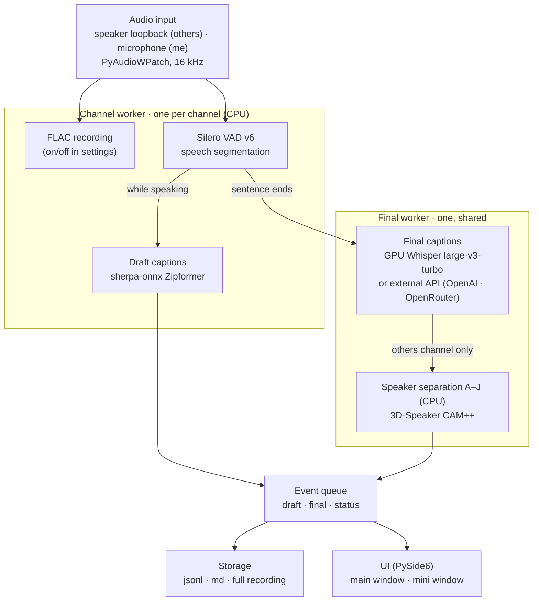

# meeting-scribe

[한국어](README.md) | **English** | [日本語](README.ja.md)

An online meeting notes app that transcribes Zoom, Discord, Teams and other online meetings in real time,
**on your own computer**. Text appears while people are speaking, and when a sentence ends a GPU model
turns it into an accurate final caption. With the default settings no audio leaves your computer; if you
have no GPU, you can have only the final captions made by an external API (OpenAI or OpenRouter).

> The app's interface and the speech it recognizes are currently Korean. Button names below are given
> as they appear in the app, with an English translation in parentheses.

## Features
- **Two-stage captions**: a grey draft caption while speaking (about 1 s), then a black final caption once the sentence ends (about 1.5 s later)
- **Others / me**: speaker output (loopback) is the other side, the microphone is you. Up to 10 remote voices are told apart as `상대 A`–`상대 J` (Speaker A–J)
- **Editable notes**: rename speakers and the title, search, browse past meetings, export to `transcript.md`
- **Mini mode**: a phone-sized window that stays on top of your meeting window
- **Built for long meetings**: designed for 2–5 hour meetings; each final sentence is written to disk immediately (it survives a crash)
- **Full audio recording** (optional): when the meeting ends, a combined `전체 녹음.flac` (full recording) of both sides is saved
- **Choice of final caption engine**: local GPU (default) or an external API (OpenAI, OpenRouter). You choose it in the settings window; it never switches by itself
- **Recognized language**: Korean speech

## Requirements
- Windows 10/11
- NVIDIA GPU (4 GB VRAM or more), driver 525 or later. Final captions run on the GPU and are **never run on the CPU instead**.
  Without a GPU, only the final captions can be made by an [external API](#final-captions-with-an-external-api-no-gpu) (OpenAI, OpenRouter), selected manually in settings.
- [uv](https://docs.astral.sh/uv/)

## Quick start (double-click)

1. Install [uv](https://docs.astral.sh/uv/) (once, in PowerShell):
   `powershell -ExecutionPolicy ByPass -c "irm https://astral.sh/uv/install.ps1 | iex"`
2. Double-click **`meeting-scribe.bat`** in the project folder

The first run downloads the packages (about 2.5 GB) and models (about 1.7 GB); after that the window opens right away (no console window).
After a `git pull`, just double-click again and changed packages are picked up automatically.
To put it on the desktop, right-click `meeting-scribe.bat` → **Create shortcut** and move the shortcut.
If something goes wrong, check `%USERPROFILE%\.meeting-scribe\logs\gui-<date>.log`.

## How to use


When the window opens, loading the engines (models) takes 10–20 seconds. When they are ready, the **기록 시작** (Start recording) button turns blue.

### Main window
The numbers follow the picture above.

1. **Speaker / microphone**: under `스피커` (Speaker), choose the output device your meeting audio plays on (the default output device is selected automatically).
   Turn on **내 마이크도 기록** (Also record my microphone) to transcribe your own voice as `나` (Me). A headset is recommended so the two do not mix.
2. **Mini mode**: switches to a small portrait window on top of your meeting window (see [Mini mode](#mini-mode)).
3. **Start / pause / stop**
   - Blue **기록 시작** (Start) → while recording it becomes orange **일시중지** (Pause) and red **기록 중지** (Stop).
   - While paused nothing is transcribed and the recording keeps only silence. Green **재개** (Resume) continues; times keep counting from the start of the meeting.
   - **기록 중지** (Stop) saves the notes and adds them to the list on the left.
4. **Rename the title**: click the title to rename the meeting (e.g. `Sprint planning`).
   Leave it empty to go back to the default `회의록 YYYY-MM-DD HH:MM`. The list on the left and `transcript.md` follow the change.
5. **Rename speakers**: click a speaker chip (e.g. `상대 A`) and give it a name (e.g. `Kim`). Every chip in that meeting, the property line at the top
   and `transcript.md` are updated; leave it empty to return to the default name. The `나` (Me) chip can be renamed too.
   The grey sentence at the bottom is not final yet, so its speaker is not known (it is replaced once the sentence ends).
6. **Past meetings / delete**: open past meetings from the list on the left and find them with the search box above it.
   The 🗑 button that appears on hover moves that meeting's folder to the **Recycle Bin** (it can be restored from there).
7. **Settings**: the **설정** (Settings) button at the bottom left opens the settings window. Changes apply only when you press **저장** (Save), and it cannot be opened while recording.
   - **전체 음성 녹음 저장** (Save full audio recording): when on, `전체 녹음.flac` is made at the end of the meeting; when off, no audio files are kept.
   - **확정 자막 엔진** (Final caption engine): `로컬 GPU` (Local GPU, default) / `외부 API · OpenAI` / `외부 API · OpenRouter`
     (see [External API](#final-captions-with-an-external-api-no-gpu)).
   - **모델** (Model, local GPU): `빠름 · large-v3-turbo` (Fast, default, ~1.5 s to final, ~1.3 GB VRAM) /
     `정확 · large-v3` (Accurate, ~3 s to final, up to ~3.2 GB VRAM, ~3 GB download the first time).
     On a 4 GB GPU, running it next to a meeting app and a browser may run out of memory. See [docs/BENCHMARKS.md](docs/BENCHMARKS.md) for a comparison.
   - Choices are saved in `%USERPROFILE%\.meeting-scribe\settings.json`.

   

The status bar at the bottom shows recording time, final caption delay (how far the GPU is behind), and GPU memory and temperature.
With an external API it shows the service and model, minutes of audio uploaded, and cost (OpenRouter only) instead of GPU details.
If the local GPU is selected but cannot be used, recording does not start and a diagnostics window (`scribe doctor`) opens.

### Mini mode


Press **미니 모드** (Mini mode) in the main window and a phone-sized portrait window appears at the bottom right of the screen.

- It stays **always on top**, so you can follow the notes while watching the meeting.
- Drag the handle at the top to move it.
- The same notes as the main window build up live, and renaming the title or speaker chips works the same way.
- Bottom buttons
  - **Start / pause / resume**: blue / orange / green depending on the state.
  - **기록 중지** (Stop, red): saves and ends the recording.
  - **이전 페이지** (Back): returns to the main window (Alt+F4 does the same).

<br clear="right">

> Everything the system plays (loopback) is transcribed, so turn off other videos and music while recording.

### Limits of speaker separation
Remote voices are compared sentence by sentence. It works well when one person speaks for several seconds;
short back-channel replies (under 2 s), overlapping speech, and a speaker change inside one sentence are not separated.
Labels start again from `상대 A` in every meeting.

## Final captions with an external API (no GPU)

If you have no NVIDIA GPU, or cannot use it, only the final captions can be made by an external API. Draft captions,
speaker separation and recording still run on your computer, and **only finished sentence segments (1–15 s)** are sent to the service you chose.

1. Open **설정** (Settings) at the bottom left and pick `외부 API · OpenAI` or `외부 API · OpenRouter` as the engine.
2. Paste your key into the **API 키** (API key) field that appears, and check it with **연결 테스트** (Test connection, sends 1 s of silence).
   Next to the field you see whether a key is stored, and **키 삭제** (Delete key) removes the stored key.
3. Pick a **모델** (Model) if needed and press **저장** (Save). The engine only changes when you save.

| | OpenAI | OpenRouter |
|---|---|---|
| Models | `whisper-1` (default), `gpt-4o-transcribe`, `gpt-4o-mini-transcribe` | `openai/whisper-large-v3-turbo` (default), `openai/whisper-large-v3`, `openai/whisper-1`, or type your own |
| Previous sentence as context | Used | Not supported (terms and names may be slightly less accurate) |
| No-speech metrics | `whisper-1` only | Not provided |
| Privacy | — | **Zero data retention (ZDR) endpoints only** (on by default, can be changed in settings) |
| Cost display | Uploaded minutes only (see OpenAI pricing) | Uploaded minutes and the sum of per-request cost |

- **No automatic switching**: the app never falls back from the GPU to an API, or from an API to the GPU.
  It only uses the engine you chose, and the engine cannot be changed while recording.
- **Key storage**: keys are encrypted with Windows DPAPI so only your Windows user can decrypt them, and stored in
  `%USERPROFILE%\.meeting-scribe\api-keys.json`. They never appear in the settings file, logs or notes. If the environment variable
  `MEETING_SCRIBE_OPENAI_API_KEY` / `MEETING_SCRIBE_OPENROUTER_API_KEY` is set, it is used first (each service only reads its own variable).
- **Failures**: if the request for a sentence fails, a `확정 실패` (Final failed) mark and the draft caption are kept in its place (also
  `⚠ 확정 실패` in the md file). On a key error, or after 3 failures in a row, only the final captions stop; draft captions and recording continue.
  Audio of failed segments is kept only if **Save full audio recording** is on.
- **Limits**: models without no-speech metrics can turn noise into sentences, so short results (2 characters or fewer, or phrases such as
  "감사합니다" / "thank you") from segments where the draft caption heard nothing are dropped. Because of this, a short reply the draft missed
  (such as "네" / "yes") can be lost. Each request takes 0.5–2 s, and ending a meeting may take a moment while the remaining sentences are sent.
- All consent for recording is the user's responsibility, including consent needed to send audio to an external service ([Recording consent](#recording-consent)).

## Saved files
Each meeting is saved in the project's `회의록\<start time>\` folder (e.g. `회의록\20261010-103000\`).
`회의록/` is excluded from git.

| File | Contents |
|---|---|
| `transcript.jsonl` | Final sentences (time, channel, speaker), written to disk one line at a time |
| `transcript.md` | Markdown notes (title, property line, paragraphs per speaker, a time heading every 10 minutes) |
| `speakers.json`, `meeting.json` | Renamed speakers and title |
| `전체 녹음.flac` | Both sides combined (when recording is on) |
| `audio-others-NNN.flac`, `audio-me-NNN.flac` | Raw audio per channel, in 10-minute parts (when recording is on) |

Models, logs and settings live in `%USERPROFILE%\.meeting-scribe\` (change it with the `MEETING_SCRIBE_HOME` environment variable).

> Why not `%LOCALAPPDATA%`: when started from a Store/MSIX app (some terminals and IDEs), Windows silently redirects
> AppData writes into that app's private space, so models would not be visible from other terminals.

## Architecture



### Models
| Role | Model | Device | Notes |
|---|---|---|---|
| Speech detection | Silero VAD v6 (bundled with faster-whisper) | CPU | 32 ms decisions, sentences up to 15 s |
| Draft captions | sherpa-onnx streaming Zipformer `kspon174m-c16` | CPU (2 threads) | RTF 0.2, first text after ~1 s, CER ~10% |
| Final captions | faster-whisper `large-v3-turbo` int8_float16 (option: `large-v3`) | **GPU** | ~1.4 s after the sentence ends, ~1.3 GB VRAM |
| Final captions (optional) | OpenAI / OpenRouter speech-to-text API | External service | Only when selected in settings ([External API](#final-captions-with-an-external-api-no-gpu)) |
| Speaker separation | 3D-Speaker CAM++ (27 MB) | CPU | +0.1–0.2 s per sentence |

### Flow
1. **Input**: speaker output (loopback) becomes the `상대` (others) channel and the microphone the `나` (me) channel. Audio is converted to 16 kHz mono,
   and silence is filled in when the speaker plays nothing so the timeline stays aligned.
2. **Channel worker** (per channel, CPU): writes FLAC if recording is on, and VAD cuts out speech segments.
   While someone speaks, the audio is streamed into Zipformer and grey draft captions appear immediately.
3. **Final worker** (shares one GPU model): finished sentences are queued and Whisper transcribes them, using the previous sentence as a hint.
   Sentences invented from silence (hallucinations) are filtered out, and sentences on the `상대` channel get an A–J label by CAM++ voice comparison.
   On a GPU error the model is restarted once; if that fails too, only the final captions stop (draft captions and recording continue).
   With an external API, only that segment's audio (FLAC) is sent to the API instead of Whisper, and failed sentences are marked `확정 실패`.
4. **Event queue**: collects draft, final and status events and passes them to storage and the UI. A final sentence replaces the draft of the same sentence.
5. **Storage / UI**: final sentences are written to `transcript.jsonl` immediately; when the meeting ends, `transcript.md` and `전체 녹음.flac` are created.
   The main and mini windows receive the same events and draw them at the same time.

At startup the CPU models and Whisper load in parallel and Whisper runs once as a warm-up, so the first final sentence is not delayed.
Loaded models stay in memory after a meeting so the next one can start right away.

| Code | Role |
|---|---|
| `src/scribe/audio/` | Loopback and microphone input, FLAC recording, combining the full recording |
| `src/scribe/vad/` | Silero VAD sentence segmentation |
| `src/scribe/asr/` | Draft captions (sherpa), final captions (Whisper / external API; `backends.py` is the only place they are built), hallucination filter |
| `src/scribe/api_keys.py` | Encrypted storage of external API keys (DPAPI) |
| `src/scribe/diarize.py` | Speaker separation A–J |
| `src/scribe/pipeline/session.py` | Channel and final worker threads and event wiring |
| `src/scribe/store/transcript.py` | jsonl writing, md export, saving names and titles |
| `src/scribe/gui/` | PySide6 UI (main, mini, settings window, theme) |
| `src/scribe/diagnostics/` | GPU diagnostics (`scribe doctor`), GPU status |

## Command line
You can also use it from a terminal without the window.

```powershell
uv sync                           # install
uv run scribe gui                 # main window (same as meeting-scribe.bat)
uv run scribe doctor              # check the GPU environment (D1–D6)
uv run scribe devices             # list audio devices
uv run scribe run                 # transcribe speaker output (loopback) live, Ctrl+C to stop
uv run scribe run --mic           # also transcribe your microphone as the 'me' channel (headset recommended)
uv run scribe run --out "$env:USERPROFILE\Documents\notes"  # output folder (default: the project's 회의록 folder)
uv run scribe run --hotwords terms.txt      # meeting terms (one per line) used as the Whisper prompt
uv run scribe run --final-model large-v3    # final caption model (default: the setting chosen in the window)
uv run scribe run --final-backend openai    # final caption engine: local / openai / openrouter (default: window setting)
uv run scribe run --final-backend openrouter --api-model openai/whisper-large-v3
uv run scribe run --file a.wav --realtime   # play a file at real-time speed and transcribe it
uv run scribe bench whisper|sherpa|e2e      # benchmarks (docs/BENCHMARKS.md)
```

In the terminal, recognized fragments are appended in grey while someone speaks, and the final caption is printed when the sentence ends.
The draft model can be changed with `--partial-model` (default `kspon174m-c16`).

## Tests
```powershell
uv run python scripts/make_fixtures.py     # generate TTS test audio (first time only)
uv run pytest                              # unit tests (no GPU needed)
uv run pytest -m gpu                       # full pipeline test with real models
uv run python scripts/check_loopback.py    # check loopback capture (plays sound on the default output)
uv run python scripts/make_screenshots.py  # regenerate README images (sample data, not a screen capture)
```

## If the GPU has problems
`scribe doctor` prints the step that failed, likely causes and fixes, and saves a report to
`%USERPROFILE%\.meeting-scribe\logs\doctor-*.txt`. Please attach it when opening an issue.
In the main window, the same diagnostics can be run in a window when the GPU cannot be used.

## Recording consent
All consent for recording is the user's responsibility. The app does not check whether participants have agreed; whoever uses it must give
any notice and obtain any consent required by applicable law and company or service rules before recording a meeting or sending audio to an external API.

## License
meeting-scribe code is released under the MIT License (full text in the [Korean README](README.md#라이선스) and in [LICENSE](LICENSE)).

### Third-party models and libraries
The following are downloaded or loaded at runtime. Models are not included in this repository; they are fetched from these sources on first run.

| Component | Use | License | Source |
|---|---|---|---|
| Whisper large-v3-turbo (CTranslate2 conversion) | final captions (GPU) | MIT | [openai/whisper](https://github.com/openai/whisper), [mobiuslabsgmbh/faster-whisper-large-v3-turbo](https://huggingface.co/mobiuslabsgmbh/faster-whisper-large-v3-turbo) |
| faster-whisper / CTranslate2 | Whisper inference | MIT | [SYSTRAN/faster-whisper](https://github.com/SYSTRAN/faster-whisper), [OpenNMT/CTranslate2](https://github.com/OpenNMT/CTranslate2) |
| Silero VAD v6 (bundled in faster-whisper) | speech segmentation | MIT | [snakers4/silero-vad](https://github.com/snakers4/silero-vad) |
| sherpa-onnx | streaming draft recognizer | Apache-2.0 | [k2-fsa/sherpa-onnx](https://github.com/k2-fsa/sherpa-onnx) |
| sherpa-onnx-streaming-zipformer-korean-2024-06-16 | draft model (`zipformer-ko`) | see upstream release | [k2-fsa/sherpa-onnx releases](https://github.com/k2-fsa/sherpa-onnx/releases/tag/asr-models) |
| icefall-asr-ko-streaming-zipformer-174m | draft model (`kspon174m-*`) | Apache-2.0 | [kangkyu/icefall-asr-ko-streaming-zipformer-174m](https://huggingface.co/kangkyu/icefall-asr-ko-streaming-zipformer-174m) |
| 3D-Speaker CAM++ (`3dspeaker_speech_campplus_sv_zh_en_16k-common_advanced`) | speaker separation A–J | Apache-2.0 | [modelscope/3D-Speaker](https://github.com/modelscope/3D-Speaker), [sherpa-onnx speaker models](https://github.com/k2-fsa/sherpa-onnx/releases/tag/speaker-recongition-models) |
| NVIDIA cuBLAS / cuDNN (pip wheels) | CUDA runtime | NVIDIA EULA | [PyPI nvidia-*-cu12](https://pypi.org/project/nvidia-cudnn-cu12/) |
| PyAudioWPatch | WASAPI loopback capture | MIT | [s0d3s/PyAudioWPatch](https://github.com/s0d3s/PyAudioWPatch) |

External services (used only when selected in settings): [OpenAI speech-to-text API](https://platform.openai.com/docs/guides/speech-to-text),
[OpenRouter audio transcription API](https://openrouter.ai/docs/guides/overview/multimodal/stt), subject to their own terms and data policies.

Test audio in `tests/fixtures` is synthesized with the Windows "Microsoft Heami" TTS voice from sentences written for this project
(`scripts/make_fixtures.py`).
