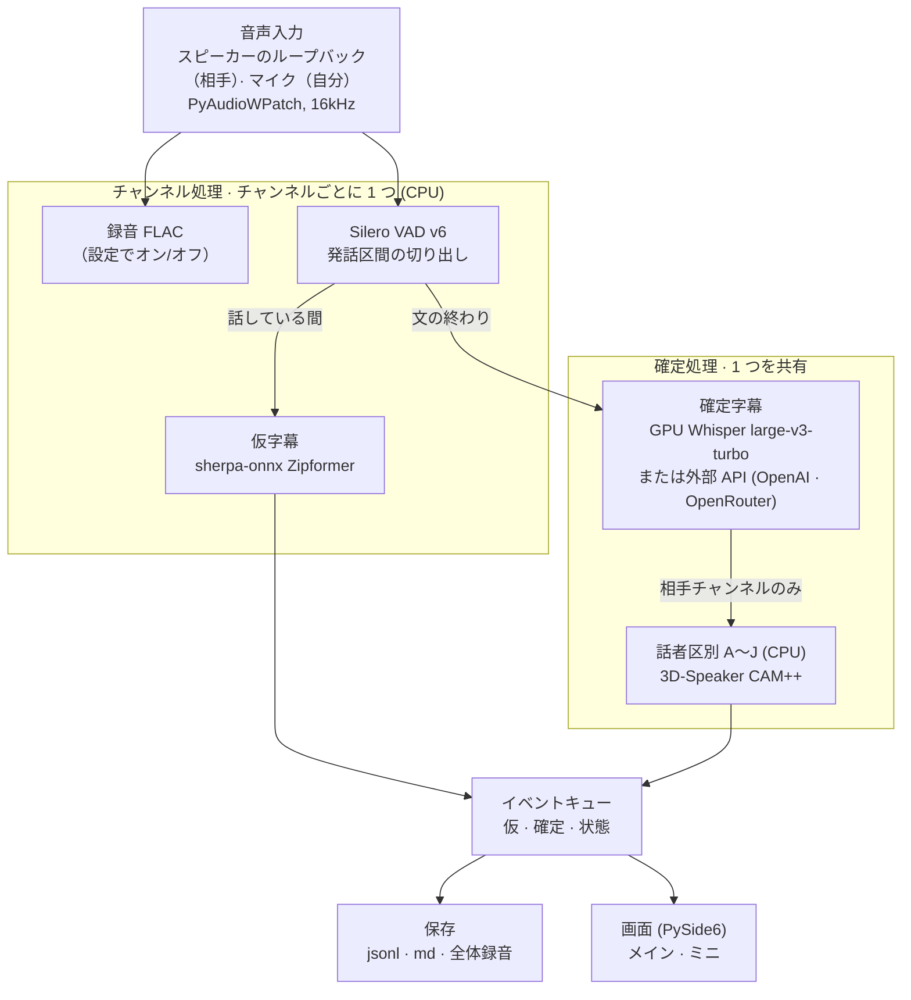

# meeting-scribe

[한국어](README.md) | [English](README.en.md) | **日本語**

Zoom、Discord、Teams などさまざまなオンライン会議を、**自分のパソコンの中で**リアルタイムに書き起こすオンライン議事録アプリです。
話している間にすぐ文字が表示され、文が終わると GPU モデルが正確な文に確定します。
既定の設定では音声が外部サーバーに送られることはありません。GPU がない場合は、確定字幕だけを外部 API（OpenAI・OpenRouter）で作ることもできます。

> アプリの画面と認識する音声は、現在韓国語です。以下のボタン名はアプリの表示どおりに記し、括弧内に日本語訳を添えています。

## 主な機能
- **2 段階の字幕**: 話している間は灰色の仮字幕（約 1 秒）、文が終わると黒の確定字幕（約 1.5 秒後）
- **相手 / 自分の区別**: スピーカー音声（ループバック）は相手、マイクは自分。相手の声は最大 10 人まで `상대 A`〜`상대 J`（相手 A〜J）に分けます
- **議事録の編集**: 話者名・タイトルの変更、検索、過去の議事録の表示、`transcript.md` への書き出し
- **ミニモード**: 会議ウィンドウの上に常に表示される、スマートフォンほどの大きさのウィンドウ
- **長い会議に対応**: 2〜5 時間の会議を想定し、確定した文はすぐにディスクへ記録（プログラムが落ちても残ります）
- **全体の音声録音**（任意）: 会議が終わると相手と自分を合わせた `전체 녹음.flac`（全体録音）を保存
- **確定字幕エンジンの選択**: ローカル GPU（既定）または外部 API（OpenAI・OpenRouter）。設定ウィンドウで自分で選び、自動では切り替わりません
- **認識言語**: 韓国語の音声

## 動作環境
- Windows 10/11
- NVIDIA GPU（VRAM 4GB 以上）、ドライバー 525 以降。確定字幕は GPU で動作し、**CPU で代わりに実行することはありません。**
  GPU がない場合は、確定字幕だけを[外部 API](#外部-api-で確定字幕gpu-なし)（OpenAI・OpenRouter）で作れます（設定で手動選択）。
- [uv](https://docs.astral.sh/uv/)

## すぐに起動（ダブルクリック）

1. [uv](https://docs.astral.sh/uv/) をインストール（初回のみ、PowerShell）:
   `powershell -ExecutionPolicy ByPass -c "irm https://astral.sh/uv/install.ps1 | iex"`
2. プロジェクトフォルダーの **`meeting-scribe.bat`** をダブルクリック

初回は必要なパッケージ（約 2.5GB）とモデル（約 1.7GB）をダウンロードし、以降はすぐにウィンドウが開きます（コンソールウィンドウなし）。
`git pull` でコードを更新した後も、そのままダブルクリックすれば変更されたパッケージが自動で反映されます。
デスクトップに置くには、`meeting-scribe.bat` を右クリック → **ショートカットの作成** で作ったショートカットを移動してください。
エラーが出た場合は `%USERPROFILE%\.meeting-scribe\logs\gui-<日付>.log` を確認してください。

## 使い方


ウィンドウが開くと、エンジン（モデル）の読み込みに 10〜20 秒ほどかかります。準備ができると **기록 시작**（記録開始）ボタンが青に変わります。

### メイン画面
上の図の番号順です。

1. **スピーカー / マイクの選択**: `스피커`（スピーカー）には会議の音声が流れる出力デバイスを選びます（既定の出力デバイスが自動で選ばれます）。
   **내 마이크도 기록**（自分のマイクも記録）をオンにすると、自分の声も `나`（自分）として書き起こします。音が混ざらないようヘッドセットをおすすめします。
2. **ミニモード**: 小さな縦長のウィンドウに切り替えて会議ウィンドウの上に表示します（[ミニモード](#ミニモード)を参照）。
3. **記録開始 / 一時停止 / 記録停止**
   - 青の **기록 시작**（記録開始）→ 記録中はオレンジの **일시중지**（一時停止）と赤の **기록 중지**（記録停止）に変わります。
   - 一時停止中は書き起こさず、録音にも無音だけが残ります。緑の **재개**（再開）を押すと記録を続け、時刻は会議開始からの通しで続きます。
   - **기록 중지**（記録停止）を押すと議事録を保存し、左のリストに追加します。
4. **タイトルの変更**: タイトルをクリックすると議事録のタイトルを変更できます（例: `スプリント計画会議`）。
   空にすると既定のタイトル `회의록 YYYY-MM-DD HH:MM` に戻ります。左のリストと `transcript.md` にも反映されます。
5. **話者名の変更**: 話者チップ（例: `상대 A`）をクリックして名前（例: `田中`）を付けます。その会議のすべてのチップ、上部のプロパティ行、
   `transcript.md` に反映され、空にすると既定の名前に戻ります。`나`（自分）チップも変更できます。
   一番下の灰色の文はまだ確定前のため、誰が話したかわからない状態です（文が終わると確定した文に置き換わります）。
6. **過去の議事録 / 削除**: 左のリストから過去の議事録を開き、上の検索欄で探せます。
   マウスを乗せると表示される 🗑 ボタンは、その会議のフォルダーを**ごみ箱**に移動します（ごみ箱から復元できます）。
7. **設定**: 左下の **설정**（設定）ボタンで設定ウィンドウが開きます。**저장**（保存）を押すと適用され、記録中は開けません。
   - **전체 음성 녹음 저장**（全体の音声録音を保存）: オンにすると会議の終了時に `전체 녹음.flac` を作り、オフにすると音声ファイルを残しません。
   - **확정 자막 엔진**（確定字幕エンジン）: `로컬 GPU`（ローカル GPU、既定）/ `외부 API · OpenAI` / `외부 API · OpenRouter`
     （[外部 API](#外部-api-で確定字幕gpu-なし) を参照）。
   - **모델**（モデル、ローカル GPU）: `빠름 · large-v3-turbo`（高速、既定、確定まで約 1.5 秒、VRAM 約 1.3GB）/
     `정확 · large-v3`（高精度、確定まで約 3 秒、VRAM 最大約 3.2GB、初回選択時に約 3GB ダウンロード）。
     4GB の GPU では、会議アプリやブラウザーと一緒に使うとメモリーが足りなくなることがあります。比較は [docs/BENCHMARKS.md](docs/BENCHMARKS.md) を参照。
   - 選択は `%USERPROFILE%\.meeting-scribe\settings.json` に保存されます。

   

下のステータスバーには、記録時間、確定待ち時間（GPU の遅れ具合）、GPU のメモリー・温度が表示されます。
外部 API を使うときは、GPU 情報の代わりにサービス・モデル、送信した音声の分量（分）、料金（OpenRouter のみ）が表示されます。
ローカル GPU を選んでいて GPU を使えない場合は、記録を始めずに診断ウィンドウ（`scribe doctor`）を開きます。

### ミニモード


メイン画面の **미니 모드**（ミニモード）を押すと、スマートフォンほどの縦長ウィンドウが画面の右下に表示されます。

- 他のウィンドウより**常に手前**に表示されるので、会議画面を見ながら議事録を確認できます。
- 上部の取っ手をドラッグするとウィンドウを移動できます。
- メイン画面と同じ議事録がリアルタイムで積み重なり、タイトルや話者チップをクリックして名前を変えることも同じようにできます。
- 下部のボタン
  - **記録開始 / 一時停止 / 再開**: 状態に応じて青 / オレンジ / 緑に変わります。
  - **기록 중지**（記録停止、赤）: 保存して記録を終えます。
  - **이전 페이지**（前のページ）: メイン画面に戻ります（Alt+F4 も同じ動作）。

<br clear="right">

> システムの音声全体（ループバック）を書き起こすため、記録中は他の動画や音楽を止めてください。

### 話者区別の限界
相手側の声を文ごとに比較して分けます。1 人が数秒以上続けて話すときはよく区別できますが、
短い相づち（2 秒未満）、同時発話、1 つの文の中で話者が変わる場合は分けられません。
ラベルは会議ごとに `상대 A` から振り直されます。

## 外部 API で確定字幕（GPU なし）

NVIDIA GPU がない、または使いにくい場合は、確定字幕だけを外部 API で作れます。仮字幕・話者区別・録音は
これまでどおりこのパソコンで行い、**文が終わった区間（1〜15 秒）だけ**を選んだサービスに送信します。

1. 左下の **설정**（設定）を開き、エンジンで `외부 API · OpenAI` または `외부 API · OpenRouter` を選びます。
2. 表示される **API 키**（API キー）欄にキーを貼り付け、**연결 테스트**（接続テスト、1 秒の無音を送信）で確認します。
   欄の横にキーが保存済みかどうかが表示され、**키 삭제**（キーを削除）で保存したキーを消せます。
3. 必要なら **모델**（モデル）を選んで **저장**（保存）を押します。エンジンは保存したときだけ切り替わります。

| | OpenAI | OpenRouter |
|---|---|---|
| モデル | `whisper-1`（既定）、`gpt-4o-transcribe`、`gpt-4o-mini-transcribe` | `openai/whisper-large-v3-turbo`（既定）、`openai/whisper-large-v3`、`openai/whisper-1`、直接入力 |
| 直前の文の文脈 | 使用 | 非対応（用語・名前の精度が少し下がることがあります） |
| 無音判定の情報 | `whisper-1` のみ提供 | 提供なし |
| プライバシー | — | **データ非保持（ZDR）の経路のみ使用**（既定でオン、設定ウィンドウで変更可） |
| 料金の表示 | 送信分量のみ表示（料金は OpenAI の料金表を確認） | 送信分量とリクエストごとの料金の合計 |

- **自動切り替えなし**: GPU が使えないからといって API に切り替えたり、API が使えないからといって GPU に切り替えたりすることはありません。
  ユーザーが選んだエンジンだけを使い、記録中は変更できません。
- **キーの保存**: この Windows ユーザーだけが復号できるよう暗号化（DPAPI）して `%USERPROFILE%\.meeting-scribe\api-keys.json` に
  保存し、設定ファイル・ログ・議事録には残しません。環境変数 `MEETING_SCRIBE_OPENAI_API_KEY` /
  `MEETING_SCRIBE_OPENROUTER_API_KEY` があれば、その値を優先します（各サービスは自分の変数だけを読みます）。
- **失敗時の処理**: ある文のリクエストが失敗すると、その場所に `확정 실패`（確定失敗）の表示と仮字幕を残します（議事録の md にも
  `⚠ 확정 실패`）。キーのエラー、または 3 回続けて失敗した場合は確定字幕だけを止め、仮字幕と録音は続けます。
  失敗した区間の音声は、**全体の音声録音を保存**をオンにした場合にのみ残ります。
- **限界**: 無音判定の情報がないモデルは雑音を文にしてしまうことがあるため、仮字幕が何も聞き取らなかった区間の
  短い結果（2 文字以下、「감사합니다（ありがとうございます）」など）は捨てます。そのため、仮字幕が聞き逃した短い返事（「네（はい）」）が
  抜けることがあります。リクエストごとに 0.5〜2 秒かかり、会議を終えるときは残りの文を送り切るまで少し待つことがあります。
- 外部サービスへ音声を送るために必要な同意を含め、録音に関するすべての同意は利用者の責任です（[録音の同意](#録音の同意)）。

## 保存されるファイル
会議ごとに、プロジェクトの `회의록\<開始時刻>\` フォルダー（例: `회의록\20261010-103000\`）に保存されます。
`회의록/` は git の対象外です。

| ファイル | 内容 |
|---|---|
| `transcript.jsonl` | 確定した文（時刻、チャンネル、話者）。1 行ずつすぐにディスクへ記録 |
| `transcript.md` | Markdown の議事録（タイトル、プロパティ行、話者ごとの段落、10 分ごとの時刻見出し） |
| `speakers.json`, `meeting.json` | 変更した話者名とタイトル |
| `전체 녹음.flac` | 相手と自分を合わせた録音（録音設定がオンのとき） |
| `audio-others-NNN.flac`, `audio-me-NNN.flac` | チャンネルごとの元の音声、10 分単位（録音設定がオンのとき） |

モデル・ログ・設定は `%USERPROFILE%\.meeting-scribe\` にあります（環境変数 `MEETING_SCRIBE_HOME` で変更可能）。

> `%LOCALAPPDATA%` を使わない理由: Store/MSIX アプリ（一部のターミナルや IDE）から起動すると、Windows が
> AppData への書き込みをそのアプリ専用の領域に黙って移すため、他のターミナルからモデルが見えなくなります。

## アーキテクチャ



### 使用するモデル
| 役割 | モデル | デバイス | 特徴 |
|---|---|---|---|
| 発話区間の検出 | Silero VAD v6（faster-whisper に同梱） | CPU | 32ms 単位で判定、1 文は最大 15 秒 |
| 仮字幕 | sherpa-onnx ストリーミング Zipformer `kspon174m-c16` | CPU（2 スレッド） | RTF 0.2、最初の文字まで約 1 秒、CER 約 10% |
| 確定字幕 | faster-whisper `large-v3-turbo` int8_float16（選択: `large-v3`） | **GPU** | 文の終わりから約 1.4 秒、VRAM 約 1.3GB |
| 確定字幕（任意） | OpenAI / OpenRouter 音声認識 API | 外部サービス | 設定で選んだときのみ（[外部 API](#外部-api-で確定字幕gpu-なし)） |
| 話者区別 | 3D-Speaker CAM++（27MB） | CPU | 1 文あたり +0.1〜0.2 秒 |

### 処理の流れ
1. **入力**: スピーカー音声（ループバック）は `상대`（相手）、マイクは `나`（自分）チャンネルになります。16kHz モノラルに変換し、
   スピーカーから音が出ていないときは無音を埋めて時刻がずれないようにします。
2. **チャンネル処理**（チャンネルごと、CPU）: 録音がオンなら FLAC で保存し、VAD が発話区間を切り出します。
   話している間はその音声を Zipformer に流し込み、灰色の仮字幕をすぐに表示します。
3. **確定処理**（GPU モデル 1 つを共有）: 文が終わるとキューに入れ、Whisper が直前の文をヒントに書き起こします。
   無音から作られた文（ハルシネーション）はフィルターで捨て、`상대` チャンネルの文には CAM++ の声の比較で A〜J のラベルを付けます。
   GPU エラーが起きると 1 度だけ再起動し、それでも駄目なら確定字幕だけを止めます（仮字幕と録音は続行）。
   外部 API を選んだ場合は、Whisper の代わりにその区間の音声（FLAC）だけを API に送り、失敗した文は `확정 실패` と表示します。
4. **イベントキュー**: 仮・確定・状態のイベントをまとめ、保存と画面に渡します。確定した文は同じ文の仮字幕と置き換わります。
5. **保存 / 画面**: 確定した文はすぐに `transcript.jsonl` に記録し、会議が終わると `transcript.md` と `전체 녹음.flac` を作ります。
   メイン画面とミニ画面は同じイベントを受け取り、同時に描画します。

起動時に CPU モデルと Whisper を並行して読み込み、Whisper を一度試運転しておくことで、最初の確定文が遅れないようにしています。
読み込んだモデルは会議が終わっても保持され、次の会議をすぐに始められます。

| コード | 役割 |
|---|---|
| `src/scribe/audio/` | ループバック・マイク入力、FLAC 録音、全体録音の結合 |
| `src/scribe/vad/` | Silero VAD による文の区間切り出し |
| `src/scribe/asr/` | 仮字幕（sherpa）、確定字幕（Whisper / 外部 API、作成箇所は `backends.py` のみ）、ハルシネーションフィルター |
| `src/scribe/api_keys.py` | 外部 API キーの暗号化保存（DPAPI） |
| `src/scribe/diarize.py` | 話者区別 A〜J |
| `src/scribe/pipeline/session.py` | チャンネル処理・確定処理のスレッドとイベントの接続 |
| `src/scribe/store/transcript.py` | jsonl の記録、md の書き出し、名前・タイトルの保存 |
| `src/scribe/gui/` | PySide6 の画面（メイン、ミニ、設定ウィンドウ、テーマ） |
| `src/scribe/diagnostics/` | GPU 診断（`scribe doctor`）、GPU 状態の表示 |

## コマンドライン
ウィンドウなしでターミナルからも使えます。

```powershell
uv sync                           # インストール
uv run scribe gui                 # メイン画面（meeting-scribe.bat と同じ）
uv run scribe doctor              # GPU 環境のチェック（D1〜D6）
uv run scribe devices             # オーディオデバイスの一覧
uv run scribe run                 # スピーカー出力（ループバック）をリアルタイムで書き起こし、Ctrl+C で終了
uv run scribe run --mic           # 自分のマイクも「自分」チャンネルとして書き起こし（ヘッドセット推奨）
uv run scribe run --out "$env:USERPROFILE\Documents\notes"  # 保存先フォルダーの指定（既定: プロジェクトの 회의록 フォルダー）
uv run scribe run --hotwords terms.txt      # 会議の用語（1 行に 1 つ）を Whisper のプロンプトに使用
uv run scribe run --final-model large-v3    # 確定字幕モデルの指定（既定: 画面で選んだ設定）
uv run scribe run --final-backend openai    # 確定字幕エンジン: local / openai / openrouter（既定: 画面の設定）
uv run scribe run --final-backend openrouter --api-model openai/whisper-large-v3
uv run scribe run --file a.wav --realtime   # ファイルを実時間の速度で再生しながら書き起こし
uv run scribe bench whisper|sherpa|e2e      # 性能測定（docs/BENCHMARKS.md）
```

ターミナルでは、話している間に認識された断片が灰色でつながり、文が終わると確定字幕が表示されます。
仮字幕のモデルは `--partial-model` で変更できます（既定値 `kspon174m-c16`）。

## テスト
```powershell
uv run python scripts/make_fixtures.py     # TTS テスト音声の生成（初回のみ）
uv run pytest                              # 単体テスト（GPU 不要）
uv run pytest -m gpu                       # 実際のモデルでパイプライン全体をテスト
uv run python scripts/check_loopback.py    # ループバック取得の確認（既定の出力デバイスで音を再生）
uv run python scripts/make_screenshots.py  # README の画面画像を作り直す（サンプルデータ、画面キャプチャではない）
```

## GPU に問題が起きたら
`scribe doctor` が失敗した段階、原因の候補、対処方法を表示し、
`%USERPROFILE%\.meeting-scribe\logs\doctor-*.txt` にレポートを残します。Issue を登録するときに添付してください。
メイン画面では、GPU を使えないときに同じ診断をウィンドウで実行できます。

## 録音の同意
録音に関するすべての同意は利用者の責任です。このアプリは参加者の同意を確認しません。会議を記録したり外部 API に音声を送ったりする際に
必要な告知と同意は、利用する人が関連する法律や会社・サービスの規則に従って得てください。

## ライセンス
meeting-scribe のコードは MIT ライセンスです（全文は[韓国語 README](README.md#라이선스) と [LICENSE](LICENSE) にあります）。

### 使用するモデルとライブラリ
実行時に以下をダウンロードまたは読み込みます。モデルはこのリポジトリに含まれず、初回実行時に各配布元から取得します。

| コンポーネント | 用途 | ライセンス | 配布元 |
|---|---|---|---|
| Whisper large-v3-turbo（CTranslate2 変換） | 確定字幕（GPU） | MIT | [openai/whisper](https://github.com/openai/whisper), [mobiuslabsgmbh/faster-whisper-large-v3-turbo](https://huggingface.co/mobiuslabsgmbh/faster-whisper-large-v3-turbo) |
| faster-whisper / CTranslate2 | Whisper の推論 | MIT | [SYSTRAN/faster-whisper](https://github.com/SYSTRAN/faster-whisper), [OpenNMT/CTranslate2](https://github.com/OpenNMT/CTranslate2) |
| Silero VAD v6（faster-whisper に同梱） | 発話区間の切り出し | MIT | [snakers4/silero-vad](https://github.com/snakers4/silero-vad) |
| sherpa-onnx | ストリーミング仮字幕 | Apache-2.0 | [k2-fsa/sherpa-onnx](https://github.com/k2-fsa/sherpa-onnx) |
| sherpa-onnx-streaming-zipformer-korean-2024-06-16 | 仮字幕モデル（`zipformer-ko`） | 配布元のリリースを参照 | [k2-fsa/sherpa-onnx releases](https://github.com/k2-fsa/sherpa-onnx/releases/tag/asr-models) |
| icefall-asr-ko-streaming-zipformer-174m | 仮字幕モデル（`kspon174m-*`） | Apache-2.0 | [kangkyu/icefall-asr-ko-streaming-zipformer-174m](https://huggingface.co/kangkyu/icefall-asr-ko-streaming-zipformer-174m) |
| 3D-Speaker CAM++（`3dspeaker_speech_campplus_sv_zh_en_16k-common_advanced`） | 話者区別 A〜J | Apache-2.0 | [modelscope/3D-Speaker](https://github.com/modelscope/3D-Speaker), [sherpa-onnx speaker models](https://github.com/k2-fsa/sherpa-onnx/releases/tag/speaker-recongition-models) |
| NVIDIA cuBLAS / cuDNN（pip wheel） | CUDA ランタイム | NVIDIA EULA | [PyPI nvidia-*-cu12](https://pypi.org/project/nvidia-cudnn-cu12/) |
| PyAudioWPatch | WASAPI ループバック取得 | MIT | [s0d3s/PyAudioWPatch](https://github.com/s0d3s/PyAudioWPatch) |

外部サービス（設定で選んだときのみ使用）: [OpenAI 音声認識 API](https://platform.openai.com/docs/guides/speech-to-text)、
[OpenRouter 音声認識 API](https://openrouter.ai/docs/guides/overview/multimodal/stt)。各サービスの規約とデータポリシーに従います。

`tests/fixtures` のテスト音声は、このプロジェクト用に書いた文を Windows の「Microsoft Heami」TTS 音声で合成したものです
（`scripts/make_fixtures.py`）。
