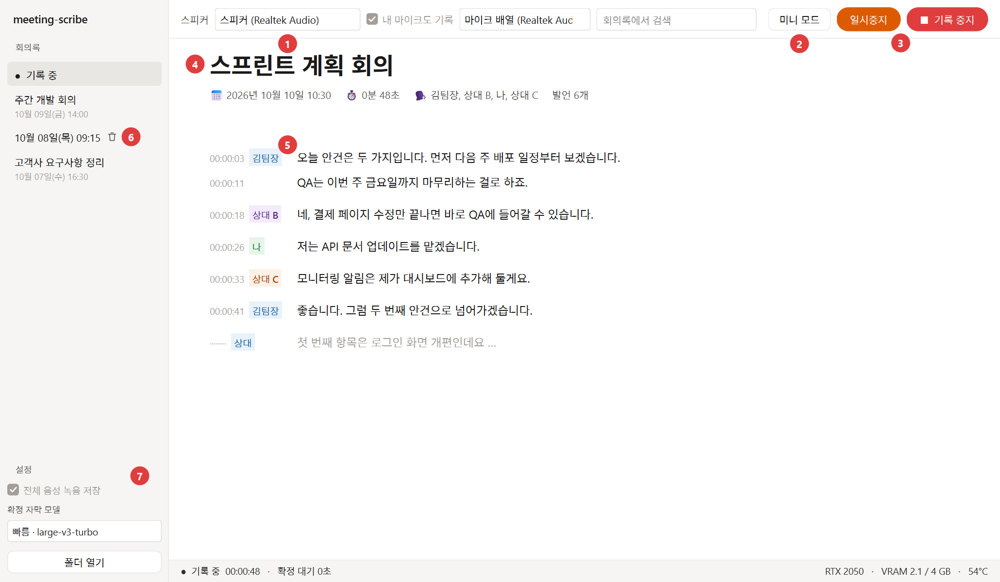
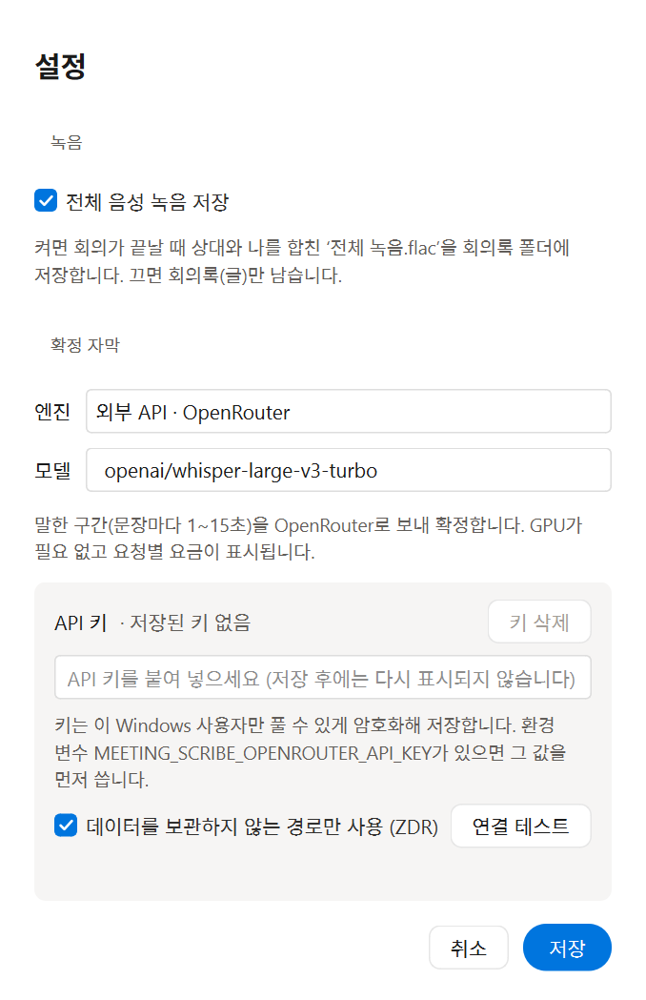
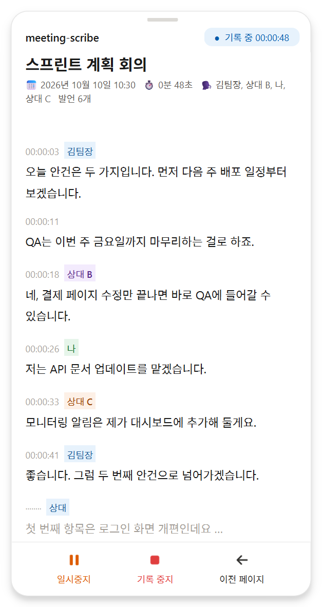
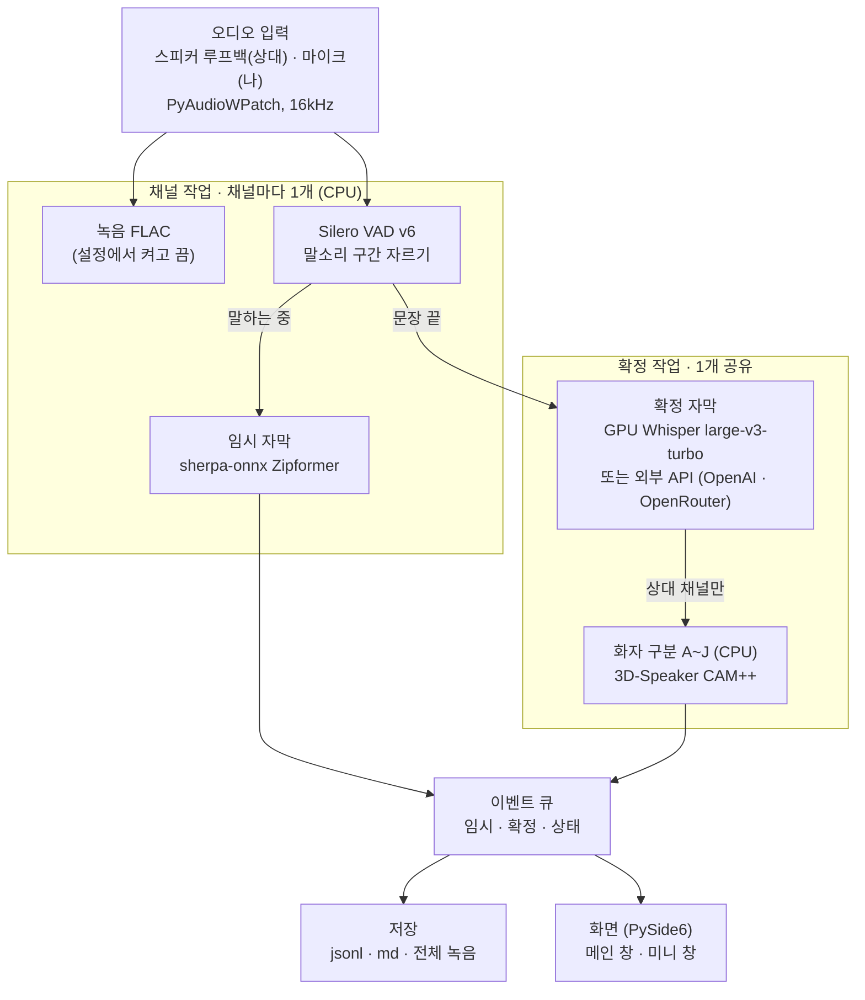

# meeting-scribe

**한국어** | [English](README.en.md) | [日本語](README.ja.md)

Zoom, Discord, Teams 등 다양한 온라인 회의를 **내 컴퓨터 안에서** 실시간으로 받아적는 온라인 회의록 앱입니다.
말하는 동안 바로 글자가 뜨고, 문장이 끝나면 GPU 모델이 정확한 문장으로 확정합니다.
기본 설정에서는 음성이 외부 서버로 나가지 않으며, GPU가 없으면 확정 자막만 외부 API(OpenAI · OpenRouter)로 만들 수도 있습니다.

## 주요 기능
- **두 단계 자막**: 말하는 동안 회색 임시 자막(약 1초), 문장이 끝나면 검정 확정 자막(약 1.5초 후)
- **상대 / 나 구분**: 스피커 소리(루프백)는 상대, 마이크는 나. 상대 목소리는 최대 10명까지 `상대 A`~`상대 J`로 나눔
- **회의록 편집**: 화자 이름·제목 바꾸기, 검색, 지난 회의록 보기, `transcript.md` 내보내기
- **미니 모드**: 회의 창 위에 항상 떠 있는 스마트폰 크기 창
- **긴 회의 대비**: 2~5시간 회의를 전제로, 확정 문장은 즉시 디스크에 기록(프로그램이 죽어도 남음)
- **전체 음성 녹음**(선택): 회의가 끝나면 상대+나를 합친 `전체 녹음.flac` 저장
- **확정 자막 엔진 선택**: 로컬 GPU(기본) 또는 외부 API(OpenAI · OpenRouter). 설정 창에서 직접 고르며 자동으로 바뀌지 않음
- **인식 언어**: 현재 한국어 음성을 받아적습니다

## 요구 사항
- Windows 10/11
- NVIDIA GPU (VRAM 4GB 이상), 드라이버 525 이상. 확정 자막은 GPU에서 동작하며 **CPU로 대신 실행하지 않습니다.**
  GPU가 없으면 확정 자막만 [외부 API](#외부-api로-확정-자막-gpu-없이)(OpenAI · OpenRouter)로 만들 수 있습니다(설정에서 직접 선택).
- [uv](https://docs.astral.sh/uv/)

## 바로 실행 (더블클릭)

1. [uv](https://docs.astral.sh/uv/) 설치 (한 번만, PowerShell):
   `powershell -ExecutionPolicy ByPass -c "irm https://astral.sh/uv/install.ps1 | iex"`
2. 프로젝트 폴더의 **`meeting-scribe.bat`** 더블클릭

처음에는 필요한 패키지(약 2.5GB)와 모델(약 1.7GB)을 내려받고, 이후에는 바로 창이 열립니다(콘솔 창 없음).
`git pull` 로 코드를 받은 뒤에도 그대로 더블클릭하면 바뀐 패키지가 자동 반영됩니다.
바탕화면에 두려면 `meeting-scribe.bat` 를 우클릭 → **바로 가기 만들기** 후 옮기면 됩니다.
오류가 나면 `%USERPROFILE%\.meeting-scribe\logs\gui-<날짜>.log` 를 확인해 주세요.

## 사용 방법



창이 열리면 엔진(모델)을 불러오는 데 10~20초 정도 걸립니다. 준비가 끝나면 **기록 시작** 버튼이 파란색으로 바뀝니다.

### 메인 화면
위 그림의 번호 순서입니다.

1. **스피커 / 마이크 선택**: `스피커`에는 회의 소리가 나오는 출력 장치를 고릅니다(기본 출력 장치가 자동 선택됨).
   **내 마이크도 기록**을 켜면 내 목소리도 `나`로 받아적습니다. 소리가 섞이지 않도록 헤드셋을 권장합니다.
2. **미니 모드**: 작은 세로 창으로 바꿔 회의 창 위에 띄웁니다(아래 [미니 모드](#미니-모드) 참고).
3. **기록 시작 / 일시중지 / 기록 중지**
   - 파란 **기록 시작** → 기록 중에는 주황 **일시중지**와 빨간 **기록 중지**로 바뀝니다.
   - 일시중지 중에는 받아적지 않고 녹음에도 무음만 남습니다. 초록 **재개**를 누르면 이어서 기록하며, 시각은 회의 시작 기준으로 이어집니다.
   - **기록 중지**를 누르면 회의록을 저장하고 왼쪽 목록에 추가합니다.
4. **제목 바꾸기**: 제목을 클릭하면 회의록 제목을 바꿀 수 있습니다(예: `스프린트 계획 회의`).
   비우면 기본 제목 `회의록 YYYY-MM-DD HH:MM`으로 돌아갑니다. 왼쪽 목록과 `transcript.md`에도 반영됩니다.
5. **화자 이름 바꾸기**: 화자 칩(예: `상대 A`)을 클릭해 이름(예: `김팀장`)을 붙입니다. 그 회의의 모든 칩과 위쪽 속성 줄,
   `transcript.md`에 반영되며, 비우면 기본 이름으로 돌아갑니다. `나` 칩도 바꿀 수 있습니다.
   맨 아래 회색 문장은 아직 확정 전이라 누가 말했는지 모르는 상태입니다(문장이 끝나면 확정 문장으로 바뀜).
6. **지난 회의록 / 삭제**: 왼쪽 목록에서 지난 회의록을 열고 위쪽 검색창으로 찾을 수 있습니다.
   마우스를 올리면 나오는 🗑 버튼은 그 회의 폴더를 **휴지통**으로 옮깁니다(휴지통에서 복원 가능).
7. **설정**: 왼쪽 아래 **설정** 버튼을 누르면 설정 창이 열립니다. **저장**을 눌러야 적용되고, 기록 중에는 열 수 없습니다.
   - **전체 음성 녹음 저장**: 켜면 회의가 끝날 때 `전체 녹음.flac`을 만들고, 끄면 음성 파일을 남기지 않습니다.
   - **확정 자막 엔진**: `로컬 GPU`(기본) / `외부 API · OpenAI` / `외부 API · OpenRouter`
     ([외부 API](#외부-api로-확정-자막-gpu-없이) 참고).
   - **모델**(로컬 GPU): `빠름 · large-v3-turbo`(기본, 확정 약 1.5초, VRAM ~1.3GB) /
     `정확 · large-v3`(확정 약 3초, VRAM 최대 ~3.2GB, 처음 선택 시 약 3GB 다운로드).
     4GB GPU에서는 회의 앱·브라우저와 함께 쓰면 메모리가 부족할 수 있습니다. 비교는 [docs/BENCHMARKS.md](docs/BENCHMARKS.md) 참고.
   - 선택은 `%USERPROFILE%\.meeting-scribe\settings.json`에 저장됩니다.

   

아래 상태 줄에는 기록 시간, 확정 대기 시간(GPU가 밀린 정도), GPU 메모리·온도가 표시됩니다.
외부 API를 쓸 때는 GPU 정보 대신 서비스·모델, 전송한 음성 분량(분), 요금(OpenRouter만)이 표시됩니다.
로컬 GPU를 골랐는데 GPU를 쓸 수 없으면 기록을 시작하지 않고 진단 창(`scribe doctor`)을 띄웁니다.

### 미니 모드



메인 화면의 **미니 모드**를 누르면 스마트폰 세로 크기의 창이 화면 오른쪽 아래에 뜹니다.

- 다른 창보다 **항상 위에** 떠 있어 회의 화면을 보면서 회의록을 확인할 수 있습니다.
- 위쪽 손잡이 부분을 잡고 끌면 창을 옮길 수 있습니다.
- 메인 화면과 같은 회의록이 실시간으로 쌓이며, 제목·화자 칩 클릭으로 이름을 바꾸는 것도 똑같이 됩니다.
- 하단 버튼
  - **기록 시작 / 일시중지 / 재개**: 상태에 따라 파랑 / 주황 / 초록으로 바뀝니다.
  - **기록 중지**(빨강): 저장하고 기록을 끝냅니다.
  - **이전 페이지**: 메인 화면으로 돌아갑니다(Alt+F4도 같은 동작).

<br clear="right">

> 시스템 소리 전체(루프백)를 받아적으므로, 기록 중에는 다른 영상·음악을 꺼 주세요.

### 화자 구분의 한계
상대 쪽 목소리를 문장마다 비교해 나눕니다. 한 사람이 몇 초 이상 이어서 말할 때 잘 구분되며,
짧은 맞장구(2초 미만), 동시 발화, 한 문장 안에서 화자가 바뀌는 경우는 나누지 못합니다.
라벨은 회의마다 `상대 A`부터 다시 매겨집니다.

## 외부 API로 확정 자막 (GPU 없이)

NVIDIA GPU가 없거나 쓰기 어려우면 확정 자막만 외부 API로 만들 수 있습니다. 임시 자막·화자 구분·녹음은
그대로 이 컴퓨터에서 하고, **문장이 끝난 구간(1~15초)만** 선택한 서비스로 전송됩니다.

1. 왼쪽 아래 **설정**을 열고 **엔진**에서 `외부 API · OpenAI` 또는 `외부 API · OpenRouter`를 고릅니다.
2. 아래에 나타나는 **API 키** 칸에 키를 붙여 넣고, **연결 테스트**(1초 무음 전송)로 확인합니다.
   키 칸 옆에 `저장된 키 있음 / 없음`이 표시되며, **키 삭제**로 저장된 키를 지울 수 있습니다.
3. 필요하면 **모델**을 고른 뒤 **저장**을 누릅니다. 엔진은 저장할 때만 바뀝니다.

| | OpenAI | OpenRouter |
|---|---|---|
| 모델 | `whisper-1`(기본), `gpt-4o-transcribe`, `gpt-4o-mini-transcribe` | `openai/whisper-large-v3-turbo`(기본), `openai/whisper-large-v3`, `openai/whisper-1`, 직접 입력 |
| 직전 문장 문맥 | 사용 | 미지원 (용어·이름 정확도가 조금 낮을 수 있음) |
| 무음 판별 정보 | `whisper-1`만 제공 | 제공 안 함 |
| 개인정보 | — | **데이터 미보관(ZDR) 경로만 사용**(기본 켜짐, 설정 창에서 변경) |
| 요금 표시 | 전송 분량만 표시 (요금은 OpenAI 요금표 확인) | 전송 분량과 요청별 요금 합계 |

- **자동 전환 없음**: GPU가 안 된다고 API로 넘어가거나, API가 안 된다고 GPU로 넘어가는 일은 없습니다.
  엔진은 사용자가 고른 것만 쓰며, 기록 중에는 바꿀 수 없습니다.
- **키 저장**: 이 Windows 사용자만 풀 수 있게 암호화(DPAPI)해 `%USERPROFILE%\.meeting-scribe\api-keys.json`에
  저장하며, 설정 파일·로그·회의록에는 남지 않습니다. 환경 변수 `MEETING_SCRIBE_OPENAI_API_KEY` /
  `MEETING_SCRIBE_OPENROUTER_API_KEY`가 있으면 그 값을 먼저 씁니다(각 서비스는 자기 변수만 읽음).
- **실패 처리**: 한 문장의 요청이 실패하면 그 자리에 `확정 실패` 표시와 임시 자막을 남깁니다(회의록 md에도
  `⚠ 확정 실패`). 키 오류이거나 3번 연속 실패하면 확정 자막만 멈추고 임시 자막·녹음은 계속됩니다.
  실패한 구간의 음성은 **전체 음성 녹음 저장**을 켠 경우에만 남습니다.
- **한계**: 무음 판별 정보가 없는 모델은 잡음이 문장으로 남을 수 있어, 임시 자막이 아무것도 못 들은 구간의
  짧은 결과(2글자 이하, "감사합니다" 등)는 버립니다. 이 때문에 임시 자막이 놓친 짧은 대답("네")이 빠질 수
  있습니다. 요청마다 0.5~2초가 걸리고, 회의를 끝낼 때 남은 문장을 마저 보내느라 조금 기다릴 수 있습니다.
- 외부 서비스로 음성을 보내는 데 필요한 동의를 포함해, 모든 녹취 동의는 사용자의 책임에 있습니다([녹취 동의](#녹취-동의)).

## 저장되는 파일
회의마다 프로젝트의 `회의록\<시작시각>\` 폴더(예: `회의록\20261010-103000\`)에 저장됩니다.
`회의록/` 은 git에서 제외되어 있습니다.

| 파일 | 내용 |
|---|---|
| `transcript.jsonl` | 확정 문장(시각, 채널, 화자). 한 줄씩 바로 디스크에 기록 |
| `transcript.md` | 마크다운 회의록(제목, 속성 줄, 화자별 문단, 10분마다 시각 제목) |
| `speakers.json`, `meeting.json` | 바꾼 화자 이름과 제목 |
| `전체 녹음.flac` | 상대+나 합본 (녹음 설정을 켰을 때) |
| `audio-others-NNN.flac`, `audio-me-NNN.flac` | 채널별 원본, 10분 단위 (녹음 설정을 켰을 때) |

모델·로그·설정은 `%USERPROFILE%\.meeting-scribe\` 에 있습니다(`MEETING_SCRIBE_HOME` 환경 변수로 변경 가능).

> `%LOCALAPPDATA%` 를 쓰지 않는 이유: Store/MSIX 앱(예: 일부 터미널, IDE)에서 실행하면 Windows가
> AppData 쓰기를 그 앱 전용 공간으로 몰래 옮겨, 다른 터미널에서는 모델이 보이지 않게 됩니다.

## 아키텍처



### 사용하는 모델
| 역할 | 모델 | 장치 | 특징 |
|---|---|---|---|
| 말소리 구간 감지 | Silero VAD v6 (faster-whisper에 포함) | CPU | 32ms 단위 판단, 문장 최대 15초 |
| 임시 자막 | sherpa-onnx 스트리밍 Zipformer `kspon174m-c16` | CPU (스레드 2개) | RTF 0.2, 첫 글자 약 1초, CER 약 10% |
| 확정 자막 | faster-whisper `large-v3-turbo` int8_float16 (선택: `large-v3`) | **GPU** | 문장 끝 후 약 1.4초, VRAM 약 1.3GB |
| 확정 자막 (선택) | OpenAI / OpenRouter 음성 인식 API | 외부 서비스 | 설정에서 직접 골랐을 때만 ([외부 API](#외부-api로-확정-자막-gpu-없이)) |
| 화자 구분 | 3D-Speaker CAM++ (27MB) | CPU | 문장당 +0.1~0.2초 |

### 흐름
1. **입력**: 스피커 소리(루프백)는 `상대`, 마이크는 `나` 채널이 됩니다. 16kHz 모노로 바꾸고,
   스피커에서 소리가 안 날 때는 무음을 채워 시간이 어긋나지 않게 합니다.
2. **채널 작업**(채널마다, CPU): 녹음을 켰다면 FLAC으로 저장하고, VAD가 말소리 구간을 자릅니다.
   말하는 동안에는 그 음성을 Zipformer에 흘려 넣어 회색 임시 자막을 바로 띄웁니다.
3. **확정 작업**(GPU 모델 1개를 같이 씀): 문장이 끝나면 대기열에 넣고 Whisper가 직전 문장을 힌트로 받아적습니다.
   무음에서 지어낸 문장(환각)은 필터로 버리고, `상대` 채널 문장에는 CAM++ 목소리 비교로 A~J 라벨을 붙입니다.
   GPU 오류가 나면 한 번 재시작하고, 그래도 안 되면 확정 자막만 멈춥니다(임시 자막과 녹음은 계속).
   외부 API를 고른 경우에는 Whisper 대신 그 구간의 음성(FLAC)만 API로 보내고, 실패한 문장은 `확정 실패`로 표시합니다.
4. **이벤트 큐**: 임시·확정·상태 이벤트를 모아 저장과 화면에 넘깁니다. 확정 문장은 같은 문장의 임시 자막 자리를 대신합니다.
5. **저장 / 화면**: 확정 문장은 `transcript.jsonl`에 즉시 기록하고, 회의가 끝나면 `transcript.md`와 `전체 녹음.flac`을 만듭니다.
   메인 창과 미니 창은 같은 이벤트를 받아 동시에 그립니다.

앱을 켤 때 CPU 모델과 Whisper를 동시에 불러오고 Whisper를 한 번 미리 돌려 두어, 첫 확정 문장이 늦어지지 않게 합니다.
불러온 모델은 회의가 끝나도 유지되어 다음 회의를 바로 시작할 수 있습니다.

| 코드 | 역할 |
|---|---|
| `src/scribe/audio/` | 루프백·마이크 입력, FLAC 녹음, 전체 녹음 합치기 |
| `src/scribe/vad/` | Silero VAD 문장 구간 자르기 |
| `src/scribe/asr/` | 임시 자막(sherpa), 확정 자막(Whisper / 외부 API, `backends.py`가 유일한 생성 지점), 환각 필터 |
| `src/scribe/api_keys.py` | 외부 API 키 암호화 저장 (DPAPI) |
| `src/scribe/diarize.py` | 화자 구분 A~J |
| `src/scribe/pipeline/session.py` | 채널 작업·확정 작업 스레드와 이벤트 연결 |
| `src/scribe/store/transcript.py` | jsonl 기록, md 내보내기, 이름·제목 저장 |
| `src/scribe/gui/` | PySide6 화면(메인, 미니, 설정 창, 테마) |
| `src/scribe/diagnostics/` | GPU 진단(`scribe doctor`), GPU 상태 표시 |

## 명령줄
창 없이 터미널에서도 쓸 수 있습니다.

```powershell
uv sync                           # 설치
uv run scribe gui                 # 메인 화면 (meeting-scribe.bat 과 같음)
uv run scribe doctor              # GPU 환경 점검 (D1~D6)
uv run scribe devices             # 오디오 장치 목록
uv run scribe run                 # 스피커 출력(루프백) 실시간 전사, Ctrl+C로 종료
uv run scribe run --mic           # 내 마이크도 '나' 채널로 함께 전사 (헤드셋 권장)
uv run scribe run --out "$env:USERPROFILE\Documents\회의록"  # 결과 저장 폴더 지정 (기본: 프로젝트의 회의록 폴더)
uv run scribe run --hotwords terms.txt      # 회의 용어(줄마다 1개)를 Whisper 프롬프트에 사용
uv run scribe run --final-model large-v3    # 확정 자막 모델 지정 (기본: 화면에서 고른 설정)
uv run scribe run --final-backend openai    # 확정 자막 엔진: local / openai / openrouter (기본: 화면 설정)
uv run scribe run --final-backend openrouter --api-model openai/whisper-large-v3
uv run scribe run --file a.wav --realtime   # 파일을 실시간 속도로 재생하며 전사
uv run scribe bench whisper|sherpa|e2e      # 성능 측정 (docs/BENCHMARKS.md)
```

터미널에는 말하는 동안 인식된 조각이 회색으로 이어 붙고, 문장이 끝나면 확정 자막이 찍힙니다.

```
  상대 ▸ 에이 이제와서 그랬다가지고 봤는데 깜짝놀랐
[00:01:50] 상대 A: 예예 이제 와서 그래가지고 봤는데 깜짝 놀랐습니다
```
임시 자막 모델은 `--partial-model`로 바꿀 수 있습니다(기본값 `kspon174m-c16`).

## 테스트
```powershell
uv run python scripts/make_fixtures.py     # TTS 테스트 음성 생성 (최초 1회)
uv run pytest                              # 단위 테스트 (GPU 불필요)
uv run pytest -m gpu                       # 실제 모델로 전체 파이프라인 테스트
uv run python scripts/check_loopback.py    # 루프백 캡처 확인 (기본 출력 장치로 소리 재생)
uv run python scripts/make_screenshots.py  # README 화면 이미지 다시 만들기 (예시 데이터, 화면 캡처 아님)
```

## GPU 문제가 생기면
`scribe doctor` 가 실패한 단계, 원인 후보, 조치 방법을 출력하고
`%USERPROFILE%\.meeting-scribe\logs\doctor-*.txt` 에 리포트를 남깁니다. 이슈 등록 시 첨부해 주세요.
메인 화면에서는 GPU를 쓸 수 없을 때 같은 진단을 창에서 실행할 수 있습니다.

## 녹취 동의
모든 녹취 동의는 사용자의 책임에 있습니다. 이 앱은 참석자의 동의를 확인하지 않으며, 회의를 기록하거나
외부 API로 음성을 보낼 때 필요한 고지와 동의는 사용하는 사람이 관련 법과 회사·서비스 규칙에 맞게 받아야 합니다.

## 라이선스
meeting-scribe 코드는 MIT 라이선스입니다.

```
MIT License

Copyright (c) 2026 meeting-scribe contributors

Permission is hereby granted, free of charge, to any person obtaining a copy
of this software and associated documentation files (the "Software"), to deal
in the Software without restriction, including without limitation the rights
to use, copy, modify, merge, publish, distribute, sublicense, and/or sell
copies of the Software, and to permit persons to whom the Software is
furnished to do so, subject to the following conditions:

The above copyright notice and this permission notice shall be included in all
copies or substantial portions of the Software.

THE SOFTWARE IS PROVIDED "AS IS", WITHOUT WARRANTY OF ANY KIND, EXPRESS OR
IMPLIED, INCLUDING BUT NOT LIMITED TO THE WARRANTIES OF MERCHANTABILITY,
FITNESS FOR A PARTICULAR PURPOSE AND NONINFRINGEMENT. IN NO EVENT SHALL THE
AUTHORS OR COPYRIGHT HOLDERS BE LIABLE FOR ANY CLAIM, DAMAGES OR OTHER
LIABILITY, WHETHER IN AN ACTION OF CONTRACT, TORT OR OTHERWISE, ARISING FROM,
OUT OF OR IN CONNECTION WITH THE SOFTWARE OR THE USE OR OTHER DEALINGS IN THE
SOFTWARE.
```

### 함께 쓰는 모델과 라이브러리
실행할 때 아래 구성 요소를 내려받거나 불러옵니다. 모델은 이 저장소에 포함되지 않으며, 처음 실행할 때 각 출처에서 받습니다.

| 구성 요소 | 용도 | 라이선스 | 출처 |
|---|---|---|---|
| Whisper large-v3-turbo (CTranslate2 변환) | 확정 자막 (GPU) | MIT | [openai/whisper](https://github.com/openai/whisper), [mobiuslabsgmbh/faster-whisper-large-v3-turbo](https://huggingface.co/mobiuslabsgmbh/faster-whisper-large-v3-turbo) |
| faster-whisper / CTranslate2 | Whisper 추론 | MIT | [SYSTRAN/faster-whisper](https://github.com/SYSTRAN/faster-whisper), [OpenNMT/CTranslate2](https://github.com/OpenNMT/CTranslate2) |
| Silero VAD v6 (faster-whisper에 포함) | 말소리 구간 자르기 | MIT | [snakers4/silero-vad](https://github.com/snakers4/silero-vad) |
| sherpa-onnx | 스트리밍 임시 자막 | Apache-2.0 | [k2-fsa/sherpa-onnx](https://github.com/k2-fsa/sherpa-onnx) |
| sherpa-onnx-streaming-zipformer-korean-2024-06-16 | 임시 자막 모델 (`zipformer-ko`) | 원본 릴리스 참고 | [k2-fsa/sherpa-onnx releases](https://github.com/k2-fsa/sherpa-onnx/releases/tag/asr-models) |
| icefall-asr-ko-streaming-zipformer-174m | 임시 자막 모델 (`kspon174m-*`) | Apache-2.0 | [kangkyu/icefall-asr-ko-streaming-zipformer-174m](https://huggingface.co/kangkyu/icefall-asr-ko-streaming-zipformer-174m) |
| 3D-Speaker CAM++ (`3dspeaker_speech_campplus_sv_zh_en_16k-common_advanced`) | 화자 구분 A~J | Apache-2.0 | [modelscope/3D-Speaker](https://github.com/modelscope/3D-Speaker), [sherpa-onnx speaker models](https://github.com/k2-fsa/sherpa-onnx/releases/tag/speaker-recongition-models) |
| NVIDIA cuBLAS / cuDNN (pip wheel) | CUDA 런타임 | NVIDIA EULA | [PyPI nvidia-*-cu12](https://pypi.org/project/nvidia-cudnn-cu12/) |
| PyAudioWPatch | WASAPI 루프백 캡처 | MIT | [s0d3s/PyAudioWPatch](https://github.com/s0d3s/PyAudioWPatch) |

외부 서비스(설정에서 직접 골랐을 때만 사용): [OpenAI 음성 인식 API](https://platform.openai.com/docs/guides/speech-to-text),
[OpenRouter 음성 인식 API](https://openrouter.ai/docs/guides/overview/multimodal/stt). 각 서비스의 약관과 데이터 정책을 따릅니다.

`tests/fixtures`의 테스트 음성은 이 프로젝트용으로 쓴 문장을 Windows "Microsoft Heami" TTS 음성으로 합성한 것입니다
(`scripts/make_fixtures.py`).
